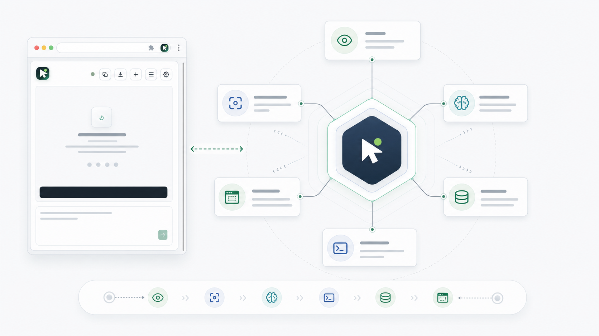
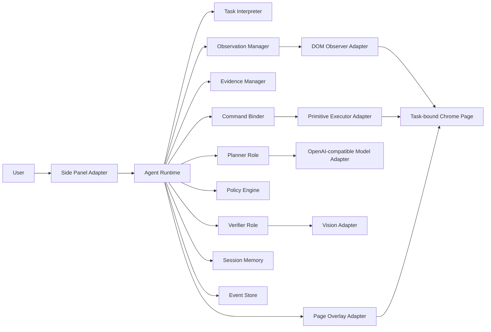
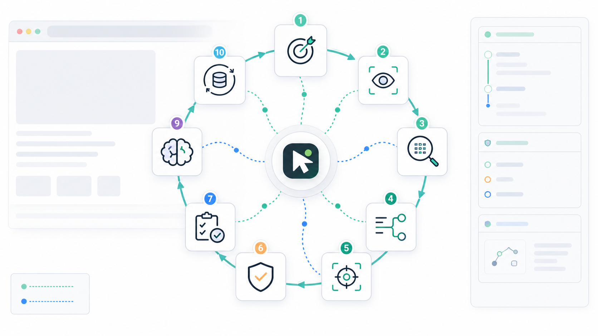

# NaturalClick Agent

<div align="center">

**A clean-rewrite Chrome MV3 browser operation Agent with a DOM-first, vision-assisted Agent Core.**

NaturalClick turns the Chrome side panel into an inspectable browser-agent workspace. It observes the task-bound page, builds evidence, plans semantic commands, executes local Chrome actions, verifies the result, and keeps a traceable session record.

[简体中文](./README.zh-CN.md) · [License](./LICENSE) · [Installable Extension](./naturalclick-extension) · [Architecture Spec](./docs/superpowers/specs/2026-06-26-agent-core-architecture-design.md) · [Side Panel Spec](./docs/superpowers/specs/2026-06-26-sidepanel-experience-design.md) · [Universal Agent Upgrade](./docs/superpowers/specs/2026-07-07-universal-agent-browser-upgrade.md)

[](./public/manifest.json)
[](./package.json)
[](./src)
[](./public/sidepanel.html)
[](./src/adapters/content/dom-observer.ts)
[](./src/core/vision/vision.ts)
[](./LICENSE)

</div>

---

## Project Status

This repository contains the active clean-rewrite implementation line for NaturalClick Agent. The current installable build is `0.1.205`.

The previous implementation proved useful product ideas, especially the conversational side panel, page element boxes, numbered targets, execution logs, and local Chrome extension packaging. The new line keeps those product lessons, but rebuilds the system around a clearer Agent Core:

- Event-driven runtime state.
- Hexagonal core with Chrome, model, storage, side panel, DOM, overlay, and vision adapters.
- Semantic commands instead of DOM-index-first planning.
- Evidence-based observation, binding, execution, and verification.
- Scoped safety policy instead of repeated confirmation prompts.
- Multi-turn conversation memory and traceable per-turn execution.
- A task-bound Chrome tab that remains stable when the user switches tabs.
- OpenAI Responses, Chat Completions, and legacy Completions protocol support.

This is not a stealth automation toolkit, CAPTCHA solver, payment bot, or anti-bot bypass project. The goal is transparent, user-controlled browser operation inside Chrome.

## Architecture Overview



NaturalClick is designed as an event-driven hexagonal Agent Core. Chrome extension surfaces are adapters around the core, not the place where the Agent's thinking lives.



Core rule:

```text
Agent Core owns thinking and state.
Capabilities own domain-specific extension points.
Adapters own Chrome reality.
The event log owns recovery and explanation.
```

## Runtime Loop



Each Agent step executes at most one semantic command.

```text
User goal
  -> Interpret task
  -> Observe current page
  -> Build task-relevant evidence
  -> Plan one semantic command
  -> Bind the command to current page targets
  -> Apply safety policy
  -> Execute one browser primitive
  -> Re-observe
  -> Verify result
  -> Persist events and update session memory
  -> Continue, ask the user, or summarize
```

Important constraints:

- Short plans guide the next few steps but are not batch-executed blindly.
- Every command declares an expected outcome.
- DOM indexes, coordinates, and tab IDs are adapter-level bindings, not the primary planning language.
- Verification failure is new evidence, not a reason to retry the same action without change.
- Vision can enhance observation, target grounding, and verification, but it does not become a second planner.

## What Is Included

```text
naturalclick-extension/
  manifest.json                 # Built Chrome MV3 manifest
  background.js                 # Built service worker entry
  content.js                    # Built content script
  sidepanel.html                # Built side panel page
  sidepanel.js                  # Built side panel runtime
  sidepanel.css                 # Built side panel styles
  icons/                        # Extension icons

src/
  core/                         # Framework-free Agent domain logic
    capabilities/
    commands/
    context/
    evidence/
    events/
    memory/
    model/
    observation/
    policy/
    runtime/
    verification/
    vision/
  adapters/                     # Chrome, content-script, and model adapters
  background/                   # MV3 service worker source
  content/                      # Content-script source
  sidepanel/                    # Conversational side panel source
  shared/                       # Shared protocol, ids, and result helpers

public/
  manifest.json                 # Source manifest copied into build output
  sidepanel.html
  sidepanel.css
  icons/

tests/
  fixtures/pages/               # Browser-like fixture pages
  unit/                         # Fast deterministic unit tests

docs/
  assets/readme/                # README images
  superpowers/specs/            # Architecture and product design specs
  superpowers/plans/            # Implementation plans
```

## Current Scope

The current build provides a complete local browser-Agent slice:

| Area | Current direction |
|---|---|
| Browser target | Chrome Manifest V3 extension |
| Runtime | Event-driven Agent loop with recoverable state |
| Observation | DOM-first page model with task-focused evidence |
| Planning | Planner emits semantic commands, not raw DOM indexes |
| Execution | Local Chrome/content-script primitives |
| Verification | Deterministic checks first, vision-assisted when useful |
| Vision | First-stage visual structure, target grounding, and visual verification |
| Side panel | Conversational runtime with settings, history, logs, and language switch |
| Overlay | User-facing target visualization, independent from Agent sensing |
| Safety | `balanced` by default, scoped consent for risky operations |
| Memory | Multi-turn history within the current session, not cross-session long-term memory |
| Model protocols | Auto negotiation across Responses, Chat Completions, and legacy Completions |
| Task target | Fixed task tab with controlled migration to Agent-opened child tabs |

Out of scope for the current build:

- CAPTCHA solving or anti-bot evasion.
- Payment, banking, identity-verification, or high-impact unattended actions.
- Backend Agent service, native messaging host, or local daemon.
- Full visual-only browsing without semantic verification.
- Full drag-and-drop Chatflow Builder editing.
- Cross-session long-term memory.

## Side Panel Experience

The side panel is the user's daily control surface. It is conversation-first when idle and operational when a task is running.

Current side panel capabilities include:

- Main conversation page.
- Top toolbar for copying logs, downloading logs, starting a new session, opening history, and opening settings.
- Compact conversation history with confirmation before deletion.
- Settings page with model configuration, page marker mode, safety mode, and plugin language.
- English and Chinese UI, defaulting to English.
- Light theme by default, with light, dark, and system modes.
- Page marker modes: `Off`, `Focus`, `All Targets`, `Evidence`, and `Vision`.
- Safety modes: `conservative`, `balanced`, `autonomous`, and `experimental_full_auto`.
- Multi-turn conversations, in-place retry for a failed turn, and no duplicate failed record after retry.
- Streaming execution details with separate reasoning, answer, and tool-argument sections when the provider exposes them.
- Live model stage, protocol, elapsed time, and timeout diagnostics while a request is running.

The old extension's page boxes and numbered markers remain a product requirement, but they are treated as visualization only:

```text
Observation is Agent sensing.
Overlay is user visualization.
Turning overlay off must not disable observation, binding, or execution.
```

## Universal Agent Upgrade

The current upgrade line focuses on general browser-operation reliability instead of site-specific flows.

- Fast execution path: explicit URL navigation and one exact visible low-risk control can execute before a planner model call.
- Page Atlas and hidden handles: observation produces a compact atlas and hidden bindable handles, so execution does not depend on visible page markers.
- Model configuration center: provider URL, API key, detected model list, planner model, and optional vision model are saved as structured settings.
- Debug overlay default-off behavior: page markers are visualization only, and `Off` removes the overlay root before vision screenshots.
- Diagnostic logs: use the side panel toolbar's copy or download log actions when reporting recognition, model, stop, or execution-speed issues.
- Task-tab ownership: switching to another Chrome tab does not redirect an active task; Agent-opened child tabs can become the new task target, and closing the target pauses the task for recovery.
- Planner protocol negotiation: `auto` probes Responses, Chat Completions, and legacy Completions with provider-aware ordering and caches successful choices.
- Planner resilience: schema validation and one repair attempt, truncated/empty-output recovery, native-tool fallback, and separate first-response, stream-idle, request, and total-budget timeouts.

## Model Configuration

Each saved model configuration contains an OpenAI-compatible endpoint, credentials, model choices, protocol preference, and capability flags.

Configure it from the side panel settings page:

1. Fill `API`.
2. Fill `API Key`.
3. Click `Detect models`.
4. Choose `Auto detect`, `Responses API`, `Chat Completions`, or `Legacy Completions` as the API protocol.
5. Let the first detected model fill `Planner model`, or choose another model from the list.
6. Optionally choose a `Vision model`.
7. Click `Save settings`.

Rules:

- `Planner model` is required before tasks can run.
- `Vision model` is optional. If it is empty, vision capability remains disabled.
- API keys are used for model detection and later model calls.
- API keys must not be written into trace logs.
- Model detection results are a convenience cache, not a source of truth.
- Existing configurations without a protocol value migrate to `Auto detect`.
- Auto mode falls back only for protocol/format incompatibility; it does not hide authentication, rate-limit, or server failures.

## Install

Clone the repository:

```bash
git clone https://github.com/kuschzzp/NaturalClick.git
cd NaturalClick
```

Install development dependencies:

```bash
npm install
```

The installable Chrome extension output is committed in `naturalclick-extension/`.

Load it in Chrome:

1. Open `chrome://extensions/`.
2. Enable **Developer mode**.
3. Click **Load unpacked**.
4. Select the `naturalclick-extension` directory.
5. Open the NaturalClick side panel from the extension icon.

After changing source files, rebuild the installable folder:

```bash
npm run build
```

Then reload the extension from `chrome://extensions/`.

## Development

Useful commands:

```bash
npm run typecheck
npm run test:unit
npm run build
npm run test:all
```

Command meaning:

| Command | Purpose |
|---|---|
| `npm run typecheck` | Run TypeScript checks without emitting files |
| `npm run test:unit` | Run deterministic unit tests |
| `npm run build` | Build `naturalclick-extension/` with Vite |
| `npm run test:all` | Run typecheck, unit tests, and production build |

Development rules:

- Keep `src/core/**` framework-free.
- Keep Chrome APIs inside adapters or extension entries.
- Prefer semantic commands and evidence over page-specific hard-coded workflows.
- Do not store raw model payloads, screenshot images, or sensitive values by default.
- Keep build output in `naturalclick-extension/` updated when source changes affect the installable extension.

## Testing

The current test suite covers:

- Manifest shape.
- Event store behavior.
- Agent runtime state transitions.
- Command binding.
- Fast-path performance guardrails.
- Context assembly and compression.
- Observation and evidence handling.
- Page Atlas fixture recognition.
- Policy and consent behavior.
- Vision result normalization.
- Verification and memory updates.
- Side panel state and rendering.
- Overlay controller behavior.
- Planner schema validation and repair behavior.
- Responses, Chat Completions, and legacy Completions streaming parsers.
- Planner timeout classification and activity heartbeats.
- Fixed task-tab selection, migration, and closed-tab recovery.

Run the full verification command before committing:

```bash
npm run test:all
```

## Safety And Privacy

NaturalClick runs inside the user's Chrome profile, but configured model endpoints may receive page summaries and, when vision is enabled and triggered, screenshots or cropped visual context.

Data that may be sent to model endpoints:

- User task text.
- Current URL and page title.
- Focused DOM/page summaries.
- Recent execution and verification history.
- Screenshot-derived visual context when vision is required.

Default privacy posture:

- Raw model requests and responses are not stored by default.
- Screenshot images are not stored by default.
- Sensitive values should be redacted before trace output.
- The side panel should show clean progress by default and keep detailed trace available on demand.
- High-risk actions are controlled by policy and scoped consent.

Hard-blocked or manual-first areas include CAPTCHA, SMS verification, payments, banking, identity verification, destructive account changes, and actions that bypass a site's normal safety controls.

## Current Limitations

- The project is still in the first clean-rewrite implementation line.
- The advanced Chatflow Builder is a future surface; the current product surface is the Chrome side panel runtime.
- Vision is triggered only as an enhancement to observation, binding, or verification.
- Model provider support is OpenAI-compatible, but provider-specific payload and streaming quirks may still need adapters.
- Service-worker suspension and content-script context loss can pause a task and require explicit resume/re-observation.
- Some complex custom controls will need additional capability modules.

## Roadmap

| Area | Planned work |
|---|---|
| Agent Core | Broader semantic command set, better reducer coverage, richer snapshots |
| Observation | Stronger framework-independent page model and control semantics |
| Vision | Cropped visual grounding, visual evidence fusion, visual verification tests |
| Side panel | Evidence inspector, trace drawer, scoped confirmation cards |
| Builder | Advanced Chatflow Builder as a separate product surface |
| Model layer | Provider compatibility profiles, richer capability diagnostics, and protocol health checks |
| Safety | Domain allowlist, clearer sensitive-data handling, stronger hard blocks |
| Packaging | Release workflow for installable Chrome extension builds |

## Contributing

Useful contributions include:

- Reproducible automation failures with exported logs.
- DOM recognition improvements for specific component libraries.
- Safer policy and verification behavior.
- Side panel usability improvements.
- Documentation improvements that clarify architecture, privacy, or operating limits.

Before submitting changes, run:

```bash
npm run test:all
```

Keep unrelated refactors separate from feature or documentation changes.

## License

NaturalClick Agent is released under the [MIT License](./LICENSE).
