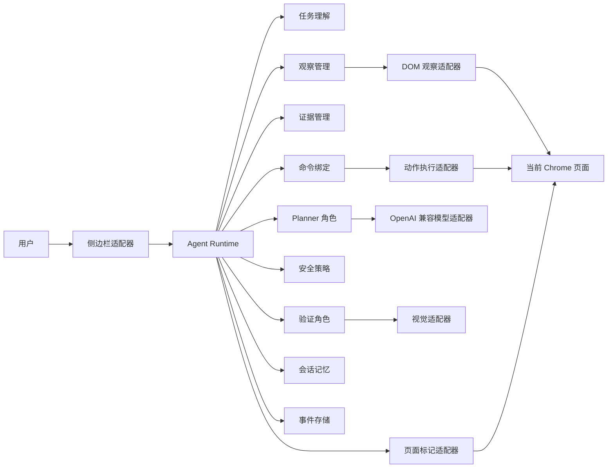

# NaturalClick Agent

<div align="center">

**一个基于 Chrome MV3 的浏览器操作 Agent。Agent Core 采用 DOM 优先、视觉增强的 clean rewrite 架构。**

NaturalClick 把 Chrome 侧边栏变成一个可检查的浏览器 Agent 工作区。它观察当前页面，整理证据，规划语义命令，在本地 Chrome 中执行动作，验证结果，并保留可追踪的会话记录。

[English](./README.md) · [许可证](./LICENSE) · [可安装扩展目录](./naturalclick-extension) · [核心架构设计](./docs/superpowers/specs/2026-06-26-agent-core-architecture-design.md) · [侧边栏体验设计](./docs/superpowers/specs/2026-06-26-sidepanel-experience-design.md)

[](./public/manifest.json)
[](./src)
[](./public/sidepanel.html)
[](./src/adapters/content/dom-observer.ts)
[](./src/core/vision/vision.ts)
[](./LICENSE)

</div>

---

## 项目状态

这个仓库是 NaturalClick Agent 的第一条 clean rewrite 实现线。

旧实现验证了一些有价值的产品想法，例如对话式侧边栏、页面元素标框、目标序号、执行日志和本地 Chrome 扩展安装方式。新实现保留这些产品经验，但不继续沿用旧代码结构。新的重点是把 Agent 内核设计清楚：

- 运行状态由事件驱动。
- Core 采用六边形架构，Chrome、模型、存储、侧边栏、DOM、页面标记和视觉能力都作为适配器接入。
- Planner 输出语义命令，而不是直接输出 DOM 索引。
- 观察、绑定、执行和验证都围绕证据展开。
- 安全确认按任务和风险范围授权，不做每个按钮都弹一次确认的体验。
- 保留当前会话记忆和可追踪执行记录。

NaturalClick 不是隐蔽自动化工具，不处理 CAPTCHA 绕过，不做支付机器人，也不用于绕开网站安全机制。它的目标是让用户在 Chrome 内拥有一个透明、可控、可调试的浏览器操作 Agent。

## 架构总览


NaturalClick 的核心是事件驱动的六边形 Agent Core。Chrome 扩展里的各个界面和运行环境是 Core 的适配器，不是 Agent 思考和状态的归宿。



核心规则：

```text
Agent Core 负责思考和状态。
Capabilities 负责可扩展能力边界。
Adapters 负责 Chrome 真实环境。
Event Log 负责恢复和解释。
```

## 运行循环


每个 Agent 步骤最多执行一个语义命令。

```text
用户目标
  -> 理解任务
  -> 观察当前页面
  -> 生成任务相关证据
  -> 规划一个语义命令
  -> 把命令绑定到当前页面目标
  -> 应用安全策略
  -> 执行一个浏览器原语
  -> 重新观察
  -> 验证结果
  -> 持久化事件并更新会话记忆
  -> 继续、询问用户或总结
```

重要约束：

- 短计划只指导接下来几步，不会被盲目批量执行。
- 每个命令必须声明预期结果。
- DOM 索引、坐标和标签页 ID 是适配器层绑定，不是规划语言。
- 验证失败会成为新证据，不应该原样重试同一个动作。
- 视觉能力只增强观察、目标定位和验证，不成为第二个 Planner。

## 目录结构

```text
naturalclick-extension/
  manifest.json                 # 构建后的 Chrome MV3 manifest
  background.js                 # 构建后的 service worker 入口
  content.js                    # 构建后的 content script
  sidepanel.html                # 构建后的侧边栏页面
  sidepanel.js                  # 构建后的侧边栏运行时代码
  sidepanel.css                 # 构建后的侧边栏样式
  icons/                        # 扩展图标

src/
  core/                         # 不依赖框架的 Agent 领域逻辑
    capabilities/
    commands/
    context/
    evidence/
    events/
    memory/
    model/
    observation/
    policy/
    runtime/
    verification/
    vision/
  adapters/                     # Chrome、content script、模型等适配器
  background/                   # MV3 service worker 源码
  content/                      # content script 源码
  sidepanel/                    # 对话式侧边栏源码
  shared/                       # 共享协议、id 和结果类型

public/
  manifest.json                 # 构建时复制到扩展目录的源 manifest
  sidepanel.html
  sidepanel.css
  icons/

tests/
  fixtures/pages/               # 类浏览器 fixture 页面
  unit/                         # 快速、确定性的单元测试

docs/
  assets/readme/                # README 图片
  superpowers/specs/            # 架构和产品设计文档
  superpowers/plans/            # 实现计划
```

## 第一版本范围

第一版本只做一个完整但克制的浏览器 Agent 垂直切片。

| 方向 | 第一版本设计 |
|---|---|
| 浏览器目标 | Chrome Manifest V3 扩展 |
| 运行时 | 事件驱动 Agent 循环，状态可恢复 |
| 观察 | DOM 优先的 PageModel，加任务聚焦证据 |
| 规划 | Planner 输出语义命令，不直接输出原始 DOM 索引 |
| 执行 | 本地 Chrome/content script 动作原语 |
| 验证 | 先做确定性验证，必要时用视觉辅助 |
| 视觉 | 第一阶段支持视觉结构、目标 grounding 和视觉验证 |
| 侧边栏 | 对话式运行时，包含设置、历史、日志和语言切换 |
| 页面标记 | 给用户看的目标可视化，不等同于 Agent 感知能力 |
| 安全 | 默认 `balanced`，对风险动作做范围化授权 |
| 记忆 | 当前会话记忆，不做跨会话长期记忆 |

第一版本不做：

- CAPTCHA 识别或反自动化绕过。
- 支付、银行、身份验证，或无人值守的高影响操作。
- 后端 Agent 服务、native messaging host 或本地 daemon。
- 只靠视觉完成任务且没有语义验证的浏览。
- 完整可拖拽编辑的 Chatflow Builder。
- 跨会话长期记忆。

## 侧边栏体验

侧边栏是用户日常使用 NaturalClick 的入口。没有任务时，它应该是一个对话入口；任务运行时，它应该变成一个可观察的执行工作台。

当前侧边栏能力包括：

- 主对话页。
- 顶部工具栏：复制执行日志、下载执行日志、新建会话、历史会话、设置。
- 当前会话历史页。
- 设置页：模型配置、页面标记模式、安全模式、插件语言。
- 中英双语界面，默认英文。
- 页面标记模式：`Off`、`Focus`、`All Targets`、`Evidence`、`Vision`。
- 安全模式：`conservative`、`balanced`、`autonomous`、`experimental_full_auto`。

旧扩展里的页面元素标框和序号仍然是产品要求，但它只负责让用户理解 Agent 看到了什么、准备操作什么：

```text
Observation 是 Agent 感知。
Overlay 是用户可视化。
关闭 Overlay 不会关闭观察、绑定或执行能力。
```

## 模型配置

第一版本使用一个全局 OpenAI-compatible Provider。

在侧边栏设置页配置：

1. 填写 `API`。
2. 填写 `API Key`。
3. 点击 `Detect models`。
4. 第一个检测到的模型会自动填入 `Planner model`，用户也可以从下拉框改选。
5. 可选配置 `Vision model`。
6. 点击 `Save settings`。

规则：

- `Planner model` 是任务运行前的必填项。
- `Vision model` 可选；不配置时视觉能力保持禁用。
- API Key 只用于模型检测和后续模型调用。
- API Key 不应写入 trace 日志。
- 模型检测结果只是便捷缓存，不是事实来源。

## 安装

克隆仓库：

```bash
git clone https://github.com/kuschzzp/NaturalClick.git
cd NaturalClick
```

安装开发依赖：

```bash
npm install
```

可安装的 Chrome 扩展输出目录已经提交在 `naturalclick-extension/`。

在 Chrome 中加载：

1. 打开 `chrome://extensions/`。
2. 开启 **Developer mode**。
3. 点击 **Load unpacked**。
4. 选择 `naturalclick-extension` 目录。
5. 点击 NaturalClick 扩展图标，打开侧边栏。

修改源码后，重新构建安装目录：

```bash
npm run build
```

然后在 `chrome://extensions/` 里重新加载扩展。

## 开发

常用命令：

```bash
npm run typecheck
npm run test:unit
npm run build
npm run test:all
```

| 命令 | 用途 |
|---|---|
| `npm run typecheck` | 运行 TypeScript 检查，不输出文件 |
| `npm run test:unit` | 运行确定性单元测试 |
| `npm run build` | 使用 Vite 构建 `naturalclick-extension/` |
| `npm run test:all` | 依次运行类型检查、单元测试和生产构建 |

开发约束：

- `src/core/**` 保持框架无关。
- Chrome API 留在 adapters 或扩展入口里。
- 优先使用语义命令和证据，不写页面专用的硬编码流程。
- 默认不存 raw model payload、截图图片和敏感值。
- 影响可安装扩展的源码改动，需要同步更新 `naturalclick-extension/`。

## 测试

当前测试覆盖：

- Manifest 结构。
- Event store 行为。
- Agent runtime 状态流转。
- 命令绑定。
- 上下文组装和压缩。
- 观察和证据处理。
- Policy 与 consent 行为。
- Vision 结果归一化。
- 验证和记忆更新。
- 侧边栏状态和渲染。
- Overlay controller 行为。

提交前运行完整验证：

```bash
npm run test:all
```

## 安全与隐私

NaturalClick 运行在用户自己的 Chrome 配置中，但用户配置的模型接口可能会收到页面摘要；启用并触发视觉能力时，也可能收到截图或裁剪后的视觉上下文。

可能发送给模型接口的数据包括：

- 用户任务文本。
- 当前 URL 和页面标题。
- 聚焦后的 DOM/PageModel 摘要。
- 最近执行和验证历史。
- 视觉能力需要时的截图衍生上下文。

默认隐私策略：

- 默认不存 raw model 请求和响应。
- 默认不存截图图片。
- 敏感值应在 trace 输出前脱敏。
- 侧边栏默认展示干净进度，详细 trace 按需查看。
- 高风险动作由 policy 和 scoped consent 控制。

CAPTCHA、短信验证、支付、银行、身份认证、破坏性账号变更，以及绕开网站正常安全机制的动作，应保持人工处理或直接阻断。

## 当前限制

- 项目仍处于第一条 clean rewrite 实现线。
- Advanced Chatflow Builder 是后续产品面；第一版本主界面是 Chrome 侧边栏运行时。
- Vision 只在观察、绑定或验证需要时触发。
- 模型 Provider 以 OpenAI-compatible 为目标，但不同 Provider 的兼容细节仍可能需要适配。
- Service worker 挂起、标签页导航和 content script 上下文丢失，需要依赖恢复和重新观察。
- 复杂自定义控件还需要更多 capability 模块支持。

## 路线图

| 方向 | 计划 |
|---|---|
| Agent Core | 扩展语义命令集，补强 reducer 覆盖，完善 snapshot |
| Observation | 更强的框架无关 PageModel 和控件语义 |
| Vision | 裁剪视觉 grounding、视觉证据融合、视觉验证测试 |
| Side panel | Evidence inspector、trace drawer、范围化确认卡片 |
| Builder | 独立的 Advanced Chatflow Builder 产品面 |
| Model layer | 能力诊断、streaming 检查、Provider 兼容配置 |
| Safety | 域名 allowlist、更清晰的敏感数据处理、更强 hard block |
| Packaging | 可安装 Chrome 扩展的发布流程 |

## 贡献

适合贡献的内容包括：

- 带导出日志的可复现自动化失败报告。
- 针对具体组件库的 DOM 识别增强。
- 更安全的 policy 和 verification 行为。
- 侧边栏可用性改进。
- 帮助解释架构、隐私或运行边界的文档。

提交前请运行：

```bash
npm run test:all
```

尽量把无关重构从功能或文档改动中拆开。

## 许可证

NaturalClick Agent 使用 [MIT License](./LICENSE) 发布。
